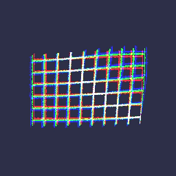

# 太极图形课S1-小作业合集

如下是作业（项目）展开说明的方法，可以帮大家理清思路，并且也对读者非常友好，请小伙伴们多多参考哦

## 背景简介
这里可以简要描述作业（项目）的基本背景情况，它源自哪里？能够有效解决哪些问题？可以尽情列举它的亮点哦

## 成功效果展示
这里可以展示这份作业（项目）run起来后的可视化效果，可以让其他人更直观感受到你的工作

### Meta Ball Demo


### Fuzzy Cloth Demo


## 整体结构（Optional）
脉络清晰的结构能完整展示你的设计思想，以及实现方式，方便读者快读代入，建议可以在repo的目录中包含如下内容：
这个部分希望大家可以大作业中加入，小作业中可以选择性加入（如果不加也是OK的）
```
-LICENSE
-|data
-README.MD
-xxx.py
```

## 运行方式
相信读者们看到这里已经迫不及待想尝试了，这里标记好快速上手的方式即可~  
例如:  `python3 meta_ball.py | fazzy_cloth.py`
